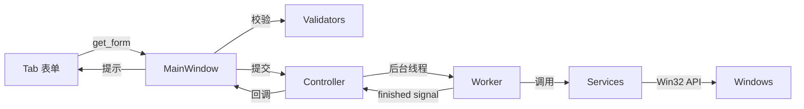

# 项目架构

## 分层结构

```
run.py / src/main.py          # 入口
    └── app/bootstrap.py      # 启动、参数解析、平台检测
    └── ui/main_window.py   # 主窗口（组装 Tab + 信号绑定）
            ├── tabs/         # 各功能页（纯 UI + 表单数据）
            ├── controller.py # UI 与 services 之间的编排
            ├── components/   # 可复用 UI 片段
            ├── widgets/      # 自定义控件
            ├── workers.py    # 后台线程执行
            └── styles.py     # QSS 样式
    └── services/           # Windows API 封装（无 Qt 依赖）
    └── utils/              # 校验、平台检测等通用工具
```

## 职责划分

| 层 | 职责 | 禁止 |
|----|------|------|
| `services/` | 调用 win32net / 权限检测 / 用户枚举 | 不 import PySide6 |
| `ui/controller.py` | 异步任务调度、错误翻译、busy 状态 | 不直接操作具体控件 |
| `ui/tabs/` | 构建表单、收集/清空输入 | 不调用 Win32 API |
| `ui/main_window.py` | 布局组装、校验提示、连接信号 | 不含大段 UI 构建代码 |
| `app/` | 应用级配置与启动流程 | 不含业务逻辑 |

## 数据流



## 扩展指南

- **新增功能页**：在 `ui/tabs/` 添加 Tab 类，在 `main_window.py` 注册
- **新增 Win32 能力**：在 `services/` 添加模块，通过 `controller.py` 暴露给 UI
- **调整样式**：仅修改 `ui/styles.py` 与 `app/config.py` 中的常量
